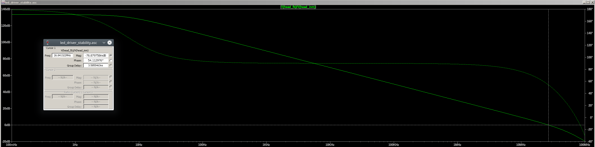

# Stability Analysis
I used open-loop analysis in LTSpice to quickly check for gain/phase margin in the op-amp circuits for the transmitter.

## Microphone Pre-amp
The microphone pre-amp is expected to have a gain of 100 V/V on the first stage and a maximum gaing of 12 V/V on stage 2. This leaves the expected bandwidth of the op-amps given the gain-bandwidth product at:

* Stage 1: 240 KHz
* Stage 2: 2.0 MHz

I setup LTSpice to perform open loop gain/phase analysis as shown below.

The two stages showed good phase and gain margin as shown below.

Stage 1 showed ~90 degree phase margin with a unity gain bandwidth of 264 KHz, right where it was expected. Although not marked gain margin is very high, >>20dB.

Stage 2 showed ~87 degree phase margin with a unity gain bandwidth of ~2 MHz, right where it was expected. Although not marked gain margin is very high, >>20dB.

This is expected to be stable.

## Headphone Input Pre-amp
The headphone amplifier is expected to have a unity gain of 1 V/V as the input is just attenuating the strong expected headphone driver signal. This leaves the expected bandwidth of the op-amps given the gain-bandwidth product at:

* Expected Bandwidth: 24 MHz

The bandwidth is ~26 MHz which is approximately what was expected and a phase margin of ~56 degrees. The gain margin is not shown but is 13.7dB.

This is expected to be stable.
